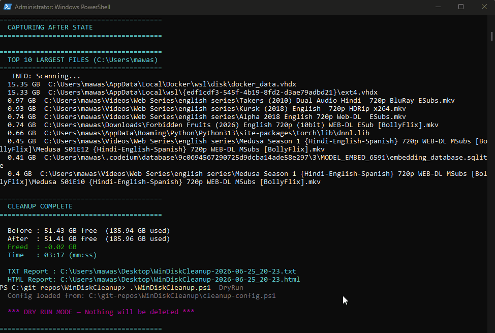

# WinDiskCleanup

A PowerShell disk cleanup script for Windows developers. Frees up space by cleaning browser caches, package manager caches, temp files, WSL/Docker virtual disks, and inactive project dependencies — all in one run.


[](https://github.com/AbdulWaseaDev/WinDiskCleanup/actions/workflows/lint.yml)

---

## Demo



> **To record:** run `.\WinDiskCleanup.ps1 -DryRun` in [Windows Terminal](https://aka.ms/terminal), record with [ScreenToGif](https://www.screentogif.com), save as `assets/demo.gif`.

---

## What It Cleans

| Step | Target | Notes |
|------|--------|-------|
| 1 | Chrome cache (all profiles) | Auto-detects all profiles |
| 2 | Claude Desktop cache | Auto-detects MSIX install |
| 3 | Microsoft Edge cache | Auto-detects all profiles |
| 4 | Firefox cache | Auto-detects all profiles |
| 5 | Brave cache | Auto-detects all profiles |
| 6 | npm cache | Skipped if npm not installed |
| 7 | pip cache | Skipped if pip not installed |
| 8 | Temp files | User temp + Windows temp |
| 9 | Windows Update cache | Safely stops/restarts wuauserv |
| 10 | Windows Store cache | wsreset |
| 11 | Recycle Bin | Configurable |
| 12 | VS Code duplicate extensions | Keeps newest version, removes older |
| 13 | Microsoft Teams cache | Classic and new MSIX Teams |
| 14 | Projects __pycache__ | Configurable path |
| 15 | Inactive node_modules | You define which ones |
| 16 | Inactive Python venvs | You define which ones |
| 17 | Docker prune | Docker Desktop or Docker in WSL — auto-detected |
| 18 | WSL apt cleanup | apt clean + autoremove |
| 19 | WSL + Docker vhdx compaction | Reclaims unused virtual disk space |

Everything is **auto-detected**. If a tool is not installed, that step is silently skipped.

No telemetry. No network calls. Runs entirely offline.

---

## Requirements

- Windows 10 or Windows 11
- PowerShell 5.1 or later (built into Windows)
- Run as **Administrator**

WSL, Docker, npm, pip, Chrome, Edge, VS Code, and Claude are all optional. The script detects what you have and skips what you don't.

---

## Installation

**Option 1 — Scoop (recommended):**

```powershell
scoop bucket add windiskcleanup https://github.com/AbdulWaseaDev/WinDiskCleanup
scoop install windiskcleanup
```

**Option 2 — Git clone:**

```powershell
git clone https://github.com/AbdulWaseaDev/WinDiskCleanup.git
cd WinDiskCleanup
```

**Option 3 — ZIP:** Download from GitHub and extract anywhere.

---

## Usage

Open PowerShell as Administrator, then:

> **First time only:** If PowerShell blocks the script, run this once:
> ```powershell
> Set-ExecutionPolicy -ExecutionPolicy RemoteSigned -Scope CurrentUser
> ```

```powershell
# Full cleanup
.\WinDiskCleanup.ps1

# Preview only — see what would be deleted without deleting anything
.\WinDiskCleanup.ps1 -DryRun

# Confirm before each step
.\WinDiskCleanup.ps1 -Interactive

# Skip WSL and Docker disk compaction (faster run)
.\WinDiskCleanup.ps1 -SkipWSLCompact

# Skip Docker pruning entirely
.\WinDiskCleanup.ps1 -SkipDocker

# Skip all projects folder cleanup (node_modules, venvs, __pycache__)
.\WinDiskCleanup.ps1 -SkipProjects
```

You can combine flags:

```powershell
.\WinDiskCleanup.ps1 -Interactive -SkipWSLCompact
```

---

## Configuration

Edit `cleanup-config.ps1` to customize the script for your machine.

### Set your projects folder(s)

Supports multiple folders across different drives — add as many as you need:

```powershell
# Single folder
$Config_ProjectsPath = @("C:\Projects")

# Multiple folders across different drives
$Config_ProjectsPath = @(
    "C:\Projects",
    "D:\Dev",
    "E:\Work"
)
```

### Add inactive node_modules to delete

```powershell
$Config_InactiveNodeModules = @(
    "C:\Projects\old-project\node_modules",
    "C:\Projects\backup\website\node_modules"
)
```

### Add inactive Python venvs to delete

```powershell
$Config_InactivePythonVenvs = @(
    "C:\Projects\old-bot\venv",
    "C:\Projects\old-scraper\.venv"
)
```

### Skip specific steps permanently

Every step can be disabled individually in `cleanup-config.ps1`:

```powershell
# Browser caches
$Config_SkipChrome        = $true
$Config_SkipEdge          = $true
$Config_SkipFirefox       = $true
$Config_SkipBrave         = $true

# Package managers
$Config_SkipNpm           = $true
$Config_SkipPip           = $true

# System
$Config_SkipTemp          = $true
$Config_SkipWindowsUpdate = $true
$Config_SkipWindowsStore  = $true
$Config_SkipRecycleBin    = $true

# Apps
$Config_SkipClaude        = $true
$Config_SkipVSCode        = $true
$Config_SkipTeams         = $true

# Projects folder
$Config_SkipPycache       = $true
$Config_SkipNodeModules   = $true
$Config_SkipPythonVenvs   = $true

# Docker / WSL
$Config_SkipDocker        = $true
$Config_SkipWSLApt        = $true
$Config_SkipWSLCompact    = $true
$Config_SkipDockerCompact = $true
```

Set any to `$true` to permanently skip that step without needing a CLI flag.

---

## Reports

After every run, two report files are saved to your Desktop:

- `WinDiskCleanup-YYYY-MM-DD_HH-mm.txt` — plain text summary
- `WinDiskCleanup-YYYY-MM-DD_HH-mm.html` — interactive dark-theme HTML report (opens automatically)

The HTML report includes:
- Before/after disk space comparison
- Savings broken down by category
- Chrome cache per profile
- Docker container status
- Top 10 largest files on your drive
- Warnings and errors log

---

## Contributing

Pull requests are welcome. See [CONTRIBUTING.md](CONTRIBUTING.md) for guidelines, testing steps, and how to suggest new cleanup steps.

---

## Changelog

See [CHANGELOG.md](CHANGELOG.md) for version history.

---

## License

MIT — see [LICENSE](LICENSE)

---

Made by [Abdul Wasea](https://github.com/AbdulWaseaDev)

---

If this saved you disk space, consider giving it a ⭐
